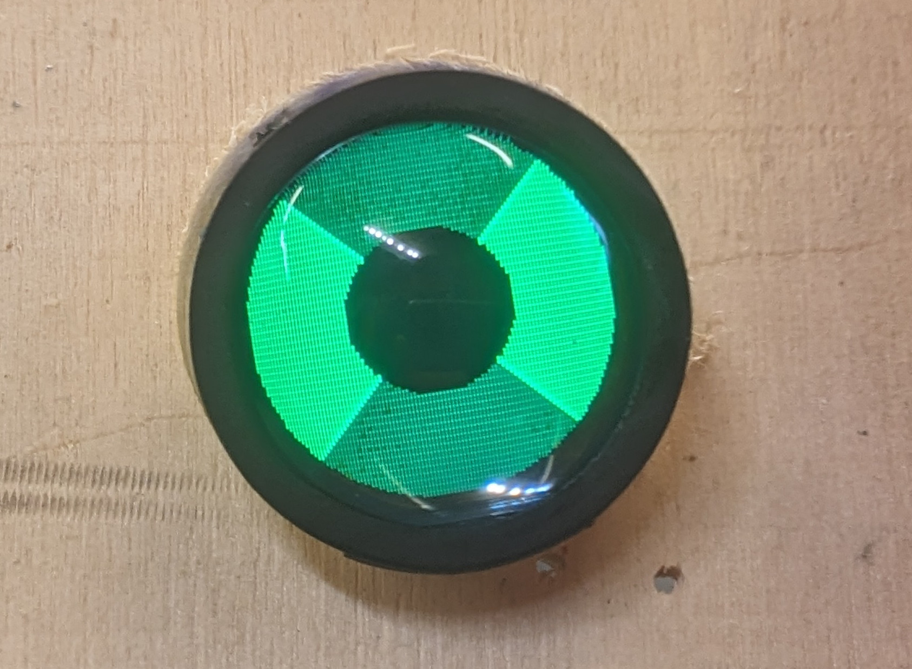
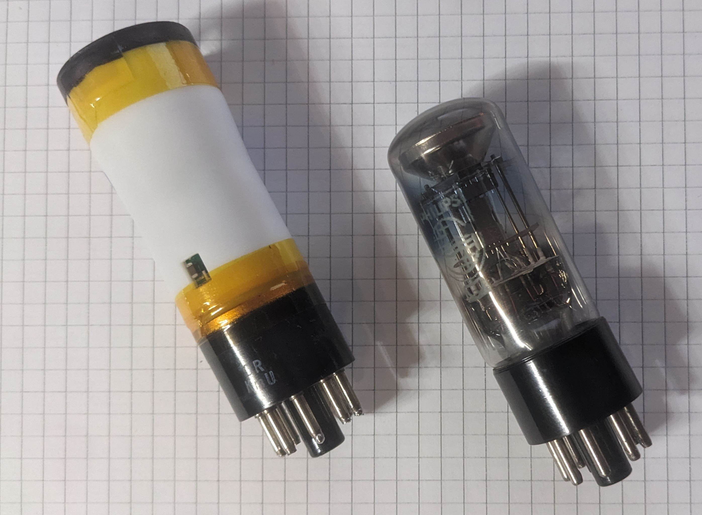
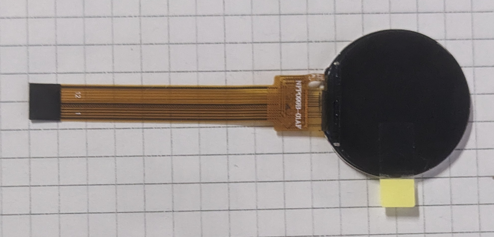

TuningIndicator EM34

# TuningIndicator_EM34

Tube in operation

Tube in comparision to a Philips EM34

## Credits

This project is based on retronics.no 6U5 replacement: https://github.com/donpivo/TuningIndicator_6U5

All PCB design files (KiCAD), fabrication files (gerber), 3D models (.stl) and code (C++, PlatformIO) are shared for personal use only; not for commercial use / sale of neither the complete solution nor parts of it.

## Replacement

The EM34 tube is expensive to buy in good condition and doesn't last that long. "Alternative" tubes only have one shadow angles instead of two.
This project creates a long-lasting tube that mimics the two shadow angles of the EM34, including different sensitivity.

## Building

Follow the guide for the 6U5 tube, it's close enough to the EM34: https://retronics.no/2024/08/29/diy-digital-6u5-magic-eye-replacement/
Be aware to use the EM34 BOM, not the 6U5 one!

### LCD

Can be found on Ebay / Aliexpress for approx. 3 Euro. Search terms: _lcd 0.99 12pin_ . Writing _NFP099-01A_ .

    

### PCB / Housing

Use the gerbers/drill files in cad/pcb/mcu_board/pcb and cad/pcb/octal_base to order at the pcb house of your choise. Use Models/DisplayBracket.stl / Models/EM34-Tube and print/order at the print house of your choise. I've used JLCPCB / JLC3D.

- You need to check your radios schematic for connection of the cathode (see comment in octal_base.pdf).
- I did not use the EMI shield.

### Programming

Use platformio + ST SWD programmer. Either use the programmer on a STM32 devboard or get a ST-LINK/V2 (approx. 15 Euro). Jtag is also exposed on my board, but doesn't have a connector. Use jumper wires to connect SWD to the programmer. The board prints debug info on the serial port.
Be aware that the LCD will not be enabled without pulling the enable pin high (=anode voltage applied)!

### Problems

- The tube is larger compared to a original EM34 (diameter of the top part 30mm instead of 27mm, length 95mm instead of 85mm). Check if your radio will fit a tube of this size!
- The LCD doesn't have good color quality / resolution
- No tube visible when radio is powered off

